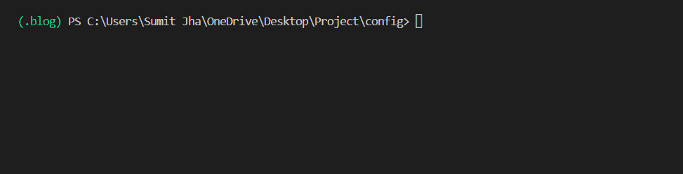

# <u> Blog app </u>
* This app is made using Django web framework.
* In this app we will see all the CRUD operations i.e.
  1. Creation of the Post.
  2. Reading the Post.
  3. Updating the existing post.
  4. Deleting the existing post.

## Admin site 

1. Create **superuser** using command : `python manage.py createsuperuser` on terminal.
    1. Then, Create User by entering ***Username***, ***Email-id*** and ***Password***.
 

2. Now ***Login*** to ***admin site*** of django.
   1. Run django server using command `python manage.py runserver` on terminal.

   
   2. Click on Development server at `http://127.0.0.1:8000/` and go to `http://127.0.0.1:8000/admin` and login to admin site.
 
